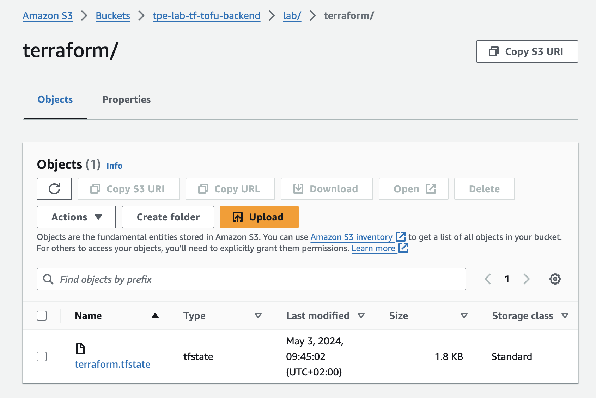
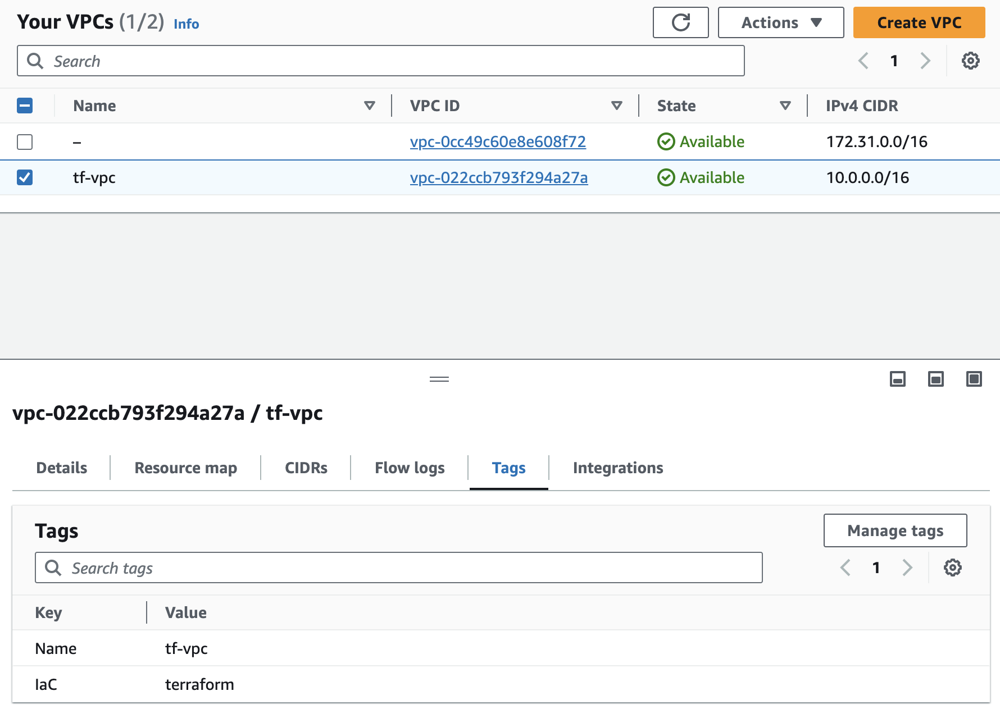

# OpenTofu Migration example

This project aims to test the migration path from Terraform to OpenTofu with a simple example.

## Prerequisites

### Environment configuration

We use the latest available versions to be as representative as possible:
- Terraform v1.8.2
- OpenTofu v1.7.0

### Infrastructure provider

We use AWS, but obviously you can use any infrastructure provider you want. 

### Backend

Backends are stored in a S3 bucket.

## The Terraform stack

The sample stack only provision a VPC on AWS, storing the state in the S3 bucket.




## Migration to OpenTofu

> According to [the migration documentation](https://opentofu.org/docs/intro/migration/terraform-1.8/), it is recommended to migrate to OpenTofu 1.7.0 when using Terraform 1.8.x, before upgrading in a latest version if exists. 

Check the version of Terraform, this documentation only works with 1.8.2:

```bash
$ terraform version

Terraform v1.8.2
on darwin_amd64
+ provider registry.terraform.io/hashicorp/aws v5.47.0
```

Ensure there is no pending changes on your project:

```bash
$ terraform plan

aws_vpc.vpc: Refreshing state... [id=vpc-022ccb793f294a27a]

No changes. Your infrastructure matches the configuration.

Terraform has compared your real infrastructure against your configuration and found no differences, so no changes are needed.
```

Backup the tfstate file if you work on a real infrastructure.

Initialize OpenTofu:

```bash
$ tofu init

Initializing the backend...

Initializing provider plugins...
- Finding hashicorp/aws versions matching "~> 5.0"...
- Installing hashicorp/aws v5.48.0...
- Installed hashicorp/aws v5.48.0 (signed, key ID 0C0AF313E5FD9F80)

Providers are signed by their developers.
If you'd like to know more about provider signing, you can read about it here:
https://opentofu.org/docs/cli/plugins/signing/

OpenTofu has made some changes to the provider dependency selections recorded
in the .terraform.lock.hcl file. Review those changes and commit them to your
version control system if they represent changes you intended to make.

OpenTofu has been successfully initialized!

You may now begin working with OpenTofu. Try running "tofu plan" to see
any changes that are required for your infrastructure. All OpenTofu commands
should now work.

If you ever set or change modules or backend configuration for OpenTofu,
rerun this command to reinitialize your working directory. If you forget, other
commands will detect it and remind you to do so if necessary.
```

Check there is no pending changes:

```bash
$ tofu plan
aws_vpc.vpc: Refreshing state... [id=vpc-022ccb793f294a27a]

No changes. Your infrastructure matches the configuration.

OpenTofu has compared your real infrastructure against your configuration and found no differences, so no changes are needed.
```

We can check the content of the tfstate file:

```json
{
  "version": 4,
  "terraform_version": "1.7.0",
  "serial": 3,
  "lineage": "5bc8aa5f-acfb-bd8a-4283-77c790a15326",
  "outputs": {},
  "resources": [
    {
      "mode": "managed",
      "type": "aws_vpc",
      "name": "vpc",
      "provider": "provider[\"registry.opentofu.org/hashicorp/aws\"]",
      "instances": [
        {
          "schema_version": 1,
          "attributes": {
            "arn": "arn:aws:ec2:eu-north-1:637423355557:vpc/vpc-07097b50807612465",
            "assign_generated_ipv6_cidr_block": false,
            "cidr_block": "10.0.0.0/16",
            "default_network_acl_id": "acl-00de0388ff4987847",
            "default_route_table_id": "rtb-0ab83421cc45fbcd8",
            "default_security_group_id": "sg-0ca25a8d0e6db1855",
            "dhcp_options_id": "dopt-04ead5177d95210d8",
            "enable_dns_hostnames": false,
            "enable_dns_support": true,
            "enable_network_address_usage_metrics": false,
            "id": "vpc-07097b50807612465",
            "instance_tenancy": "default",
            "ipv4_ipam_pool_id": null,
            "ipv4_netmask_length": null,
            "ipv6_association_id": "",
            "ipv6_cidr_block": "",
            "ipv6_cidr_block_network_border_group": "",
            "ipv6_ipam_pool_id": "",
            "ipv6_netmask_length": 0,
            "main_route_table_id": "rtb-0ab83421cc45fbcd8",
            "owner_id": "637423355557",
            "tags": {
              "IaC": "terraform",
              "Name": "tf-vpc"
            },
            "tags_all": {
              "IaC": "terraform",
              "Name": "tf-vpc"
            }
          },
          "sensitive_attributes": [],
          "private": "eyJzY2hlbWFfdmVyc2lvbiI6IjEifQ=="
        }
      ]
    }
  ],
  "check_results": null
}
```

Remark the providers list which has been updated to rely on the OpenTofu registry.

Let's make a simple change on our VPC to verify that OpenTofu is working:

```bash
# Create a VPC
resource "aws_vpc" "vpc" {
  cidr_block = "10.0.0.0/16"

  tags = {
    Name = "tf-vpc"
    # IaC  = "terraform"
    Iac = "opentofu"
  }
}
```

Let's have a look to `tofu plan`:

```bash
$ tofu plan

aws_vpc.vpc: Refreshing state... [id=vpc-07097b50807612465]

OpenTofu used the selected providers to generate the following execution plan. Resource actions are indicated with the following symbols:
  ~ update in-place

OpenTofu will perform the following actions:

  # aws_vpc.vpc will be updated in-place
  ~ resource "aws_vpc" "vpc" {
        id                                   = "vpc-07097b50807612465"
      ~ tags                                 = {
          - "IaC"  = "terraform" -> null
          + "Iac"  = "opentofu"
            "Name" = "tf-vpc"
        }
      ~ tags_all                             = {
          - "IaC"  = "terraform" -> null
          + "Iac"  = "opentofu"
            # (1 unchanged element hidden)
        }
        # (14 unchanged attributes hidden)
    }

Plan: 0 to add, 1 to change, 0 to destroy.

──────────────────────────────────────────────────────────────────────────────────────────────────────────────────────────────────────────────────────────────────────────────────────────────────────────────

Note: You didn't use the -out option to save this plan, so OpenTofu can't guarantee to take exactly these actions if you run "tofu apply" now.
```

Everything looks ok, so let's apply this change:

```bash
$ tofu apply 
aws_vpc.vpc: Refreshing state... [id=vpc-07097b50807612465]

OpenTofu used the selected providers to generate the following execution plan. Resource actions are indicated with the following symbols:
  ~ update in-place

OpenTofu will perform the following actions:

  # aws_vpc.vpc will be updated in-place
  ~ resource "aws_vpc" "vpc" {
        id                                   = "vpc-07097b50807612465"
      ~ tags                                 = {
          - "IaC"  = "terraform" -> null
          + "Iac"  = "opentofu"
            "Name" = "tf-vpc"
        }
      ~ tags_all                             = {
          - "IaC"  = "terraform" -> null
          + "Iac"  = "opentofu"
            # (1 unchanged element hidden)
        }
        # (14 unchanged attributes hidden)
    }

Plan: 0 to add, 1 to change, 0 to destroy.

Do you want to perform these actions?
  OpenTofu will perform the actions described above.
  Only 'yes' will be accepted to approve.

  Enter a value: yes

aws_vpc.vpc: Modifying... [id=vpc-07097b50807612465]
aws_vpc.vpc: Modifications complete after 1s [id=vpc-07097b50807612465]

Apply complete! Resources: 0 added, 1 changed, 0 destroyed.
```

## Is it possible to reverse the migration ?

We successfully migrated from Terraform to OpenTofu. But what if we want to come back to Terraform ?

Let's try to make a `terraform init` to see if it's possible:
```bash
$ terraform init
Initializing the backend...
╷
│ Error: Backend configuration changed
│ 
│ A change in the backend configuration has been detected, which may require migrating existing state.
│ 
│ If you wish to attempt automatic migration of the state, use "terraform init -migrate-state".
│ If you wish to store the current configuration with no changes to the state, use "terraform init -reconfigure".
╵
```

It's not as easy, let's try with `terraform init -migrate-state`:

```bash
$ terraform init -migrate-state
Initializing the backend...
Backend configuration changed!

Terraform has detected that the configuration specified for the backend
has changed. Terraform will now check for existing state in the backends.

╷
│ Error: Failed to decode current backend config
│ 
│ The backend configuration created by the most recent run of "terraform init" could not be decoded: unsupported attribute "allowed_account_ids". The configuration may have been initialized by an earlier
│ version that used an incompatible configuration structure. Run "terraform init -reconfigure" to force re-initialization of the backend.
╵
```

and with `terraform init -reconfigure`:

```bash
$ terraform init reconfigure

Initializing the backend...

Successfully configured the backend "s3"! Terraform will automatically
use this backend unless the backend configuration changes.

Initializing provider plugins...
- Finding hashicorp/aws versions matching "~> 5.0"...
- Reusing previous version of registry.opentofu.org/hashicorp/aws from the dependency lock file
- Installing hashicorp/aws v5.48.0...
- Installed hashicorp/aws v5.48.0 (signed by HashiCorp)
- Using previously-installed registry.opentofu.org/hashicorp/aws v5.48.0

Terraform has made some changes to the provider dependency selections recorded
in the .terraform.lock.hcl file. Review those changes and commit them to your
version control system if they represent changes you intended to make.

Terraform has been successfully initialized!

You may now begin working with Terraform. Try running "terraform plan" to see
any changes that are required for your infrastructure. All Terraform commands
should now work.

If you ever set or change modules or backend configuration for Terraform,
rerun this command to reinitialize your working directory. If you forget, other
commands will detect it and remind you to do so if necessary.
```

It looks like terraform has managed to regain control!

```bash
$ terraform plan
aws_vpc.vpc: Refreshing state... [id=vpc-07097b50807612465]

No changes. Your infrastructure matches the configuration.

Terraform has compared your real infrastructure against your configuration and found no differences, so no changes are needed.
```

We need to apply a change in order to check that Terraform success updating the tfstate. Here is the file after the update:

```json
{
  "version": 4,
  "terraform_version": "1.8.2",
  "serial": 7,
  "lineage": "5bc8aa5f-acfb-bd8a-4283-77c790a15326",
  "outputs": {},
  "resources": [
    {
      "mode": "managed",
      "type": "aws_vpc",
      "name": "vpc",
      "provider": "provider[\"registry.terraform.io/hashicorp/aws\"]",
      "instances": [
        {
          "schema_version": 1,
          "attributes": {
            "arn": "arn:aws:ec2:eu-north-1:637423355557:vpc/vpc-07097b50807612465",
            "assign_generated_ipv6_cidr_block": false,
            "cidr_block": "10.0.0.0/16",
            "default_network_acl_id": "acl-00de0388ff4987847",
            "default_route_table_id": "rtb-0ab83421cc45fbcd8",
            "default_security_group_id": "sg-0ca25a8d0e6db1855",
            "dhcp_options_id": "dopt-04ead5177d95210d8",
            "enable_dns_hostnames": false,
            "enable_dns_support": true,
            "enable_network_address_usage_metrics": false,
            "id": "vpc-07097b50807612465",
            "instance_tenancy": "default",
            "ipv4_ipam_pool_id": null,
            "ipv4_netmask_length": null,
            "ipv6_association_id": "",
            "ipv6_cidr_block": "",
            "ipv6_cidr_block_network_border_group": "",
            "ipv6_ipam_pool_id": "",
            "ipv6_netmask_length": 0,
            "main_route_table_id": "rtb-0ab83421cc45fbcd8",
            "owner_id": "637423355557",
            "tags": {
              "IaC": "terraform",
              "Name": "tf-vpc"
            },
            "tags_all": {
              "IaC": "terraform",
              "Name": "tf-vpc"
            }
          },
          "sensitive_attributes": [],
          "private": "eyJzY2hlbWFfdmVyc2lvbiI6IjEifQ=="
        }
      ]
    }
  ],
  "check_results": null
}
```

Terraform is now able to manage the project and we can see that the providers list has been updated to rely on the hashicorp registry. 

## Conclusion

Be careful that this example is the easiest case ever, our stack just contains a VPC not a full complex stacks, so it may not be representative of the migration of a production environment.

The migration to OpenTofu is quite easy "for now" and well documented. I said "for now" because it's all related to versions. The current version of OpenTofu is close to the Terraform one, and made to welcome Hashicorp former customers. Over time, the gap may widen and lead to two distinct products. Migration would then not be as easy as shown here, and there could be some incompatibilities.
